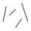
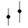
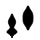
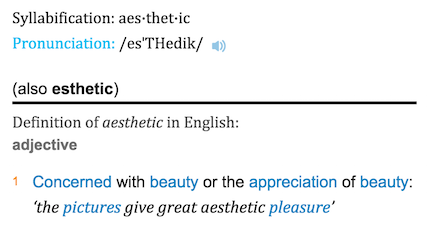
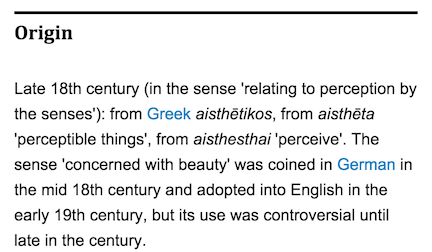

```{r include=FALSE}
library(ggplot2)
library(dplyr)
```

## Glyphs and Data

In its original sense, in archeology, a glyph is a carved symbol.

Heiro**glyph** | Mayan **glyph**
---------------|----------------
 |  

## Data Glyph

### A data glyph is also a mark, e.g. 

               

The features of a data glyph encodes the value of variables. 

* Some are very simple, e.g. a dot: 
* Some combine different elements, e.g. a pointrange: 
* Some are complicated, e.g. a dotplot: 

See: *<http://docs.ggplot2.org/current/>*

## Data Glyph Properties: Aesthetics

e.g. Point glyph: x, y, shape, color, size, transparency

```{r echo=FALSE, fig.keep='all', out.width="50%"}
set.seed(101)
n <- 30
Tmp <- data.frame(
  sbp =  round(runif(n, min=80, max=180)),
  dbp = round(runif(n, min=40, max=110)),
  group = sample(c("Tr","Ctl"), size=n, replace=TRUE),
  react = sample( c("Low", "Sev", "Mod"), size=n, replace=TRUE)
)
Tmp <- Tmp %>% mutate(dbp = pmin(sbp, dbp))
p <- ggplot(Tmp, aes(x = sbp, y = dbp)) + xlab("Systolic BP") + ylab("Diastolic BP")
p + geom_point(aes(color = group, size=react)) 
p + geom_point(size=5, aes(shape=group, color=react))
```

## Why "Aesthetic"?



## Some Graphics Components

**frame**
: The relationship between position and the data being plotted.

**glyph**
: The basic graphical "unit" that represents one case.  Other terms used include "mark" and "symbol." Variables set graphical attributes of the shape: size, color, shape, and so on. The location of the glyph --- location is an important graphical attribute! --- is set by the two variables defining the frame.

**scale**
: The relationship between the value of a variable and the graphical attribute to be displayed for that value

**guide**
: An indication for the human viewer of the scale, that is, graphics how a variable encodes into its graphical attribute.  Common guides are x- and y-axis tick marks and color keys.

## Glyph-Ready Data

Glyph-ready data has this form:

* There is one row for each data glyph to be drawn. 
* The variables are those that make up the features of the glyph.

<div class="columns-2">
```{r echo=FALSE}
head(Tmp)
```

```{r echo=FALSE}
Tmp2 <- Tmp %>%
  rename(x=sbp, y=dbp, color=react, shape=group )
head(Tmp2)
```
</div>

It's as if the variables were given the name of the aesthetic.

## The Goal of Data Wrangling

* Get your data into glyph-ready form.
* "Glyph-ready" is also model-ready, descriptive-stats ready, and so on.

## The Frame

Include faceting

## Layers

Made with `geom_XXXX()`

## Graphics syntax 

### Lattice

```r
xyplot(y ~ x, data = your_data_table)
histogram( ~ x, data = your_data_table)
```
That is:

**Graphic Form** `(` variables `, data = your_data_table)`

### ggplot2

```r
ggplot(data = your_data_table) + geom_point(aes(x=x, y=y))
ggplot(data = your_data_table) + geom_histogram(aes(x=x))
```

## Start out with a GUI

Map variables to aesthetics with `mScatter()`,  `mDistribution()`, `mBar()` (`mWorldMap()`)  [note: lattice graphics with `mPlot()`]
    ```{r eval=FALSE}
require(DCF)
require(DCFinteractive)
DCFinteractive::mScatter( your_data_frame )   
```